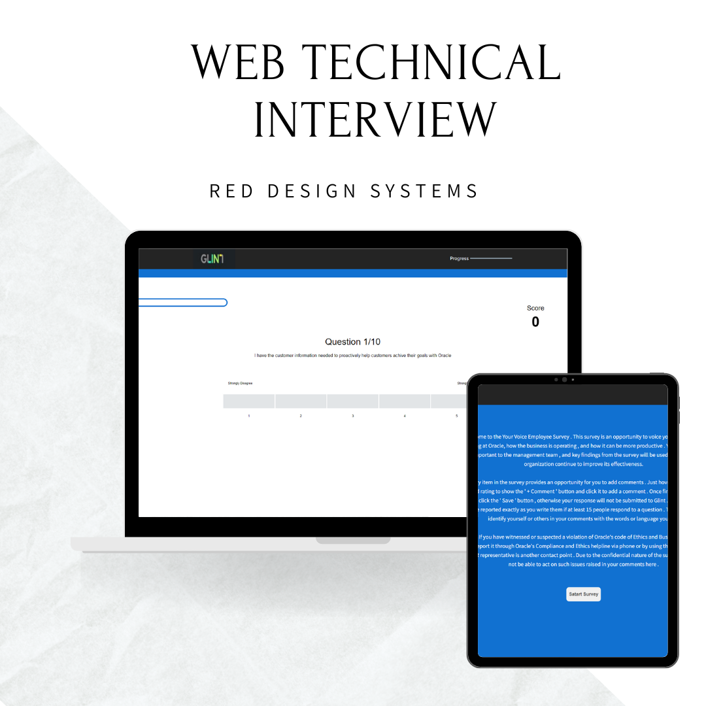
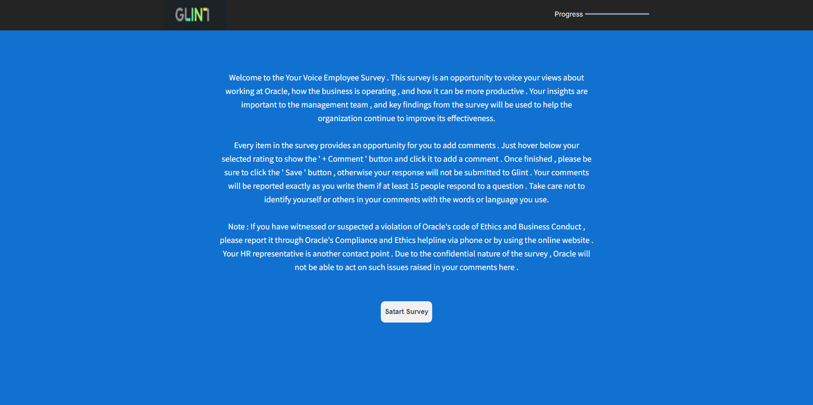
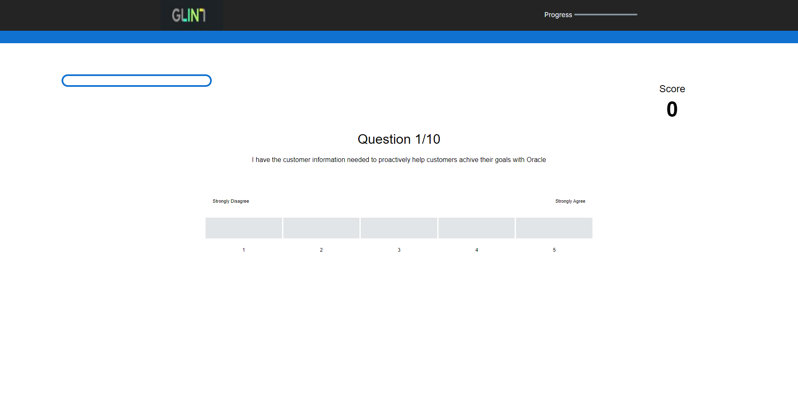
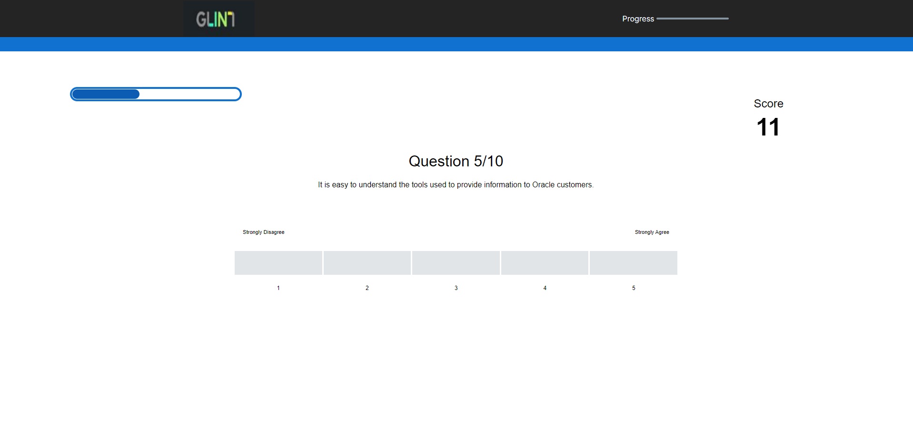
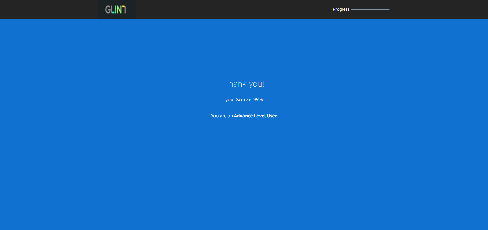

# WEB TECHNICAL INTERVIEW

## Sistema de encuesta 

En el sprint  planteado se desea implementar un quiz interactivo en donde se registren los datos, de los puntos de vista sobre el trabajo en Oracle, para verificar como funciona la empresa y como puede ser mas  productiva. consta de 10 preguntas en donde el porcentaje, el Score  y las preguntas van avanzando segun sea desarrollada la encuesta.

### Vista de Inicio 

### Vista de preguntas

***

### Vista Fin de Encuesta

***

## Tecnologias usadas

| Tecnologia      |    | 
|-------------------|-------------|
|    | JavaScript   | 
|        | CSS       | 
|  | HTML | 